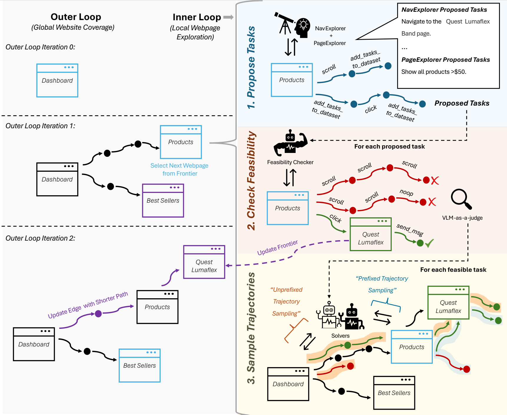

<div align="center">
  <h1>Go-Browse: Training Web Agents with Structured Exploration</h1>
  <a href="https://arxiv.org/abs/2506.03533">
    
  </a>
  <a href="https://img.shields.io/badge/PRs-Welcome-red">
    
  </a>
  
</div>

## Table of Contents
- [Overview](#overview)
- [Setup](#setup)
- [MiniWob++ Integration](#miniwob-integration)
  - [Quick Start with MiniWob++](#quick-start-with-miniwob)
  - [MiniWob++ Exploration](#miniwob-exploration)
  - [MiniWob++ Training](#miniwob-training)
- [Collect Dataset](#collect-dataset)
  - [Process Collected Go-Browse Dataset for Training](#process-collected-go-browse-dataset-for-training)
  - [Process NNetNav Dataset for Training](#process-nnetnav-dataset-for-training)
- [Finetune a Model](#finetune-a-model)
- [Benchmark a Model on WebArena](#benchmark-a-model-on-webarena)
- [Run an Episode on a Website](#run-an-episode-on-a-website)
- [Go-Browse-WA Dataset and Trained Models Release](#go-browse-wa-dataset-and-trained-models-release)
- [Citation](#citation)


## Overview

Go-Browse is a method for automatic, unsupervised collection of high-quality and diverse web agent training data via structured exploration of websites. 

Go-Browse has an outer loop that iteratively builds up a graph of previously visited webpages on a website (incentivizing global website coverage) and an inner loop that thoroughly explores each discovered webpage by: (1) Proposing tasks to solve on that page and tasks to discover neighboring pages; (2) Filtering these tasks to feasible ones by trying to solve them and judging successes with a strong computer-use LM + a VLM-as-a-judge and (3) Sampling additional task-solving trajectories with various other pretrained LMs.



By resetting the inner loop to previously discovered webpages, the outer loop helps Go-Browse reuse information across the multiple inner loop invocations, enabling more efficient and deeper exploration of websites.

We release [Go-Browse-WA](#go-browse-wa-dataset-and-trained-models-release), a dataset collected by running Go-Browse on 100 webpages from WebArena websites, collecting ~10K successful task-solving trajectories and ~17K unsuccessful ones.

Finetuning Qwen-2.5-7B-Instruct on Go-Browse-WA achieves state-of-the-art performance for sub-10B parameter models on the WebArena benchmark with a overall success rate of 21.7%, beating the previous best finetuned sub-10B model by 2.9 percentage points and beating GPT-4o-mini by 2.4 percentage points.

## Setup

Note, we ran our experiments with Python 3.12, though earlier python versions may also work.

1. Follow the instructions here to install browsergym with webarena and playwright with chromium: https://github.com/ServiceNow/BrowserGym
2. Install `webexp` and dependencies:
```sh
pip install -r requirements.txt
pip install -e .
```
3. Setup a WebArena Server using the instructions here: [webarena readme](https://github.com/web-arena-x/webarena/blob/main/environment_docker/README.md). You can also optionally setup the a reset server to remotely reset the webarena environments by: 
    - Copy/clone over the webarena-reset folder to your webarena hosting instance
    - `pip install fastapi[standard]` on this instance.
    - `cd webarena-reset`
    - `export BASE_URL=<PUBLIC URL for your instance>`
    - `fastapi run reset_server.py`
    - You can now reset a specific domain at once (e.g. map with `<RESET_SERVER_URL>/reset/map`) or all domains at once with (e.g., `<RESET_SERVER_URL>/reset/all`).

## MiniWob++ Integration

Go-Browse now supports MiniWob++ environments for easier setup and experimentation. MiniWob++ provides a collection of simple web interaction tasks that are perfect for developing and testing web agents.

### Quick Start with MiniWob++

1. **Install MiniWob++**:
```bash
pip install miniwob
```

2. **Set up Chrome environment**:
```bash
python setup_chrome.py
```

3. **Run a simple demo**:
```bash
python demo_miniwob_exploration.py
```

4. **Run benchmark evaluation**:
```bash
python -m webexp.benchmark.run_miniwob -c configs/azure_gpt_miniwob.yaml
```

### MiniWob++ Exploration

Collect training data by running agents on MiniWob++ tasks:

```bash
# List available environments
python run_miniwob_exploration.py list

# Run exploration with basic configuration (21 environments, 10 episodes each)
python run_miniwob_exploration.py run --config configs/miniwob_explore_config.yaml

# Run exploration with advanced configuration (40+ environments, 20 episodes each)
python run_miniwob_exploration.py run --config configs/miniwob_explore_advanced.yaml

# Create custom configuration
python run_miniwob_exploration.py create-config \
    --output my_config.yaml \
    --env_names click-test click-button text-input \
    --episodes_per_env 15 \
    --agent_type azure
```

### MiniWob++ Training

Train models on collected MiniWob++ data:

```bash
# Analyze collected exploration data
python run_miniwob_training.py analyze ./exploration_results/miniwob_basic

# Check training requirements
python run_miniwob_training.py check

# Train model on collected data
python run_miniwob_training.py train --config configs/miniwob_train_config.yaml

# Train with custom parameters
python run_miniwob_training.py train \
    --config configs/miniwob_train_config.yaml \
    --exploration_dir ./exploration_results/miniwob_advanced \
    --output_dir ./models/my_miniwob_model \
    --epochs 5
```

**Supported Cloud Providers**:
- **Azure AI**: GPT-4o, GPT-4o-mini with Azure OpenAI Service
- **Amazon Bedrock**: Claude 3.5 Sonnet and other models

**Key Features**:
- 🚀 Easy setup compared to WebArena
- 🎯 40+ MiniWob++ environments supported
- 📊 Automatic data collection and analysis
- 🤖 Multi-agent exploration (different agents for exploration vs evaluation)
- 📈 Supervised fine-tuning pipeline
- 🔧 Comprehensive Chrome setup and troubleshooting

For detailed instructions, see [MINIWOB_EXPLORE_TRAIN_GUIDE.md](MINIWOB_EXPLORE_TRAIN_GUIDE.md).

## Collect Dataset
Example config file used for Go-Browse-WA data generation is: `configs/go_browse_config.yaml`

For each domain (website) that you want to run data generation for, duplicate/modify the config file by filling in placeholders and then run:
```sh
python -m webexp.explore.algorithms.web_explore -c configs/web_explore_config.yaml
```

### Process Collected Go-Browse Dataset for Training
First, set the input and output paths as appropriate in `projects/go-browse/data/generate_dataset.py` and `projects/go-browse/data/process_dataset.py`

Then:
```sh
python projects/go-browse/data/generate_dataset.py
python projects/go-browse/data/process_dataset.py
```

### Process NNetNav Dataset for Training
First, set the output path as appropriate in `projects/go-browse/data/process_nnetnav_data.py`

Then:
```
python projects/go-browse/data/process_nnetnav_data.py
```

## Finetune a Model
First, replace the placeholder paths/env vars as appropriate in `webexp/train/sft_policy.py`

Then:
```
python webexp/train/sft_policy.py
```

## Benchmark a Model on WebArena
If benchmarking a finetuned model, first serve the model using an inference server like [vllm](https://docs.vllm.ai/en/latest/) or [sglang](https://docs.sglang.ai/). We used `vllm` in our experiments.

Duplicate/edit the following config file by filling in the placeholders: `configs/benchmark_webarena.yaml`.

Then:
```
python -m webexp.benchmark.run_webarena -c configs/benchmark_webarena.yaml
```

## Benchmark a Model on MiniWob++
**NEW**: Go-Browse now supports the MiniWob++ benchmark, which is easier to set up and provides over 100 web interaction tasks.

### Setup for MiniWob++
1. Install additional dependencies:
```sh
pip install miniwob browsergym omegaconf
```

2. Install Chrome/Chromium and ChromeDriver:
```sh
# Quick install (recommended)
./install_chrome.sh

# Or manual install on Ubuntu/Debian
sudo apt install chromium-browser chromium-chromedriver xvfb

# Or use the setup script
python setup_chrome.py
```

3. Install cloud provider dependencies (optional):
```sh
# For Azure AI support
pip install langchain-openai

# For Amazon Bedrock support  
pip install boto3
```

### Running MiniWob++ Benchmark

Go-Browse supports three model providers:

#### OpenAI API (Original)
```sh
export OPENAI_API_KEY='your-openai-api-key'
cp configs/example_miniwob_config.yaml configs/my_config.yaml
python -m webexp.benchmark.run_miniwob -c configs/my_config.yaml
```

#### Azure AI (GPT-4o)
```sh
export api_key_azure='your-azure-api-key'
export api_base_azure_ai='https://your-resource.openai.azure.com/'
python -m webexp.benchmark.run_miniwob -c configs/azure_gpt_miniwob.yaml

```

#### Amazon Bedrock (Claude)
```sh
export AWS_KEY='your-aws-access-key'
export AWS_SECRET_KEY='your-aws-secret-key'
export AWS_REGION='us-east-1'
cp configs/bedrock_claude_miniwob.yaml configs/my_bedrock_config.yaml
python -m webexp.benchmark.run_miniwob -c configs/my_bedrock_config.yaml
```

### Quick Demo
Try the demo scripts to test your setup:
```sh
python demo_miniwob.py                    # Basic demo
python demo_cloud_agents.py               # Compare all agent types
python demo_miniwob.py --list             # See available environments
```

For detailed information about the MiniWob++ adaptation, see [MINIWOB_ADAPTATION.md](MINIWOB_ADAPTATION.md).

### Troubleshooting Chrome Issues

If you encounter Chrome-related errors:

1. **Quick fix**: Run `./install_chrome.sh` or `python setup_chrome.py`
2. **Manual setup**: See [CHROME_SETUP_GUIDE.md](CHROME_SETUP_GUIDE.md)
3. **Headless environments**: Use `DISPLAY=:99 python -m webexp.benchmark.run_miniwob ...`

Common error: `"Unable to obtain driver for chrome"` → Install ChromeDriver: `sudo apt install chromium-chromedriver`

## Run an Episode on a Website
If performing inference with a finetuned model, first serve the model using an inference server like [vllm](https://docs.vllm.ai/en/latest/) or [sglang](https://docs.sglang.ai/).

Duplicate/edit the following config file by filling in the placeholders: `configs/benchmark_webarena.yaml`.

Then:
```
python -m webexp.agents.run_episode -c configs/benchmark_webarena.yaml
```

## Go-Browse-WA Dataset and Trained Models Release

Datasets (on HF Hub):
- Processed dataset (output of `projects/go-browse/data/process_dataset.py`): [apurvaga/go-browse-wa](https://huggingface.co/datasets/apurvaga/go-browse-wa).

This includes both successful and unsuccessful trajectories processed for finetuning. Page observations are represented as accessibility trees (potentially truncated for context length limits while training).

- Raw dataset: [apurvaga/go-browse-wa-raw](https://huggingface.co/datasets/apurvaga/go-browse-wa-raw)

Raw version includes screenshots, pruned_html, full accessibility tree text and additional metadata.

Finetuned models (on HF Hub):
- [apurvaga/go-browse-wa-qwen-7B](https://huggingface.co/apurvaga/go-browse-wa-qwen-7B)
- [apurvaga/nnetnav-wa-qwen-7B](https://huggingface.co/apurvaga/nnetnav-wa-qwen-7B)

## Citation
```bibtex
@misc{gandhi2025gobrowse,
      title={Go-Browse: Training Web Agents with Structured Exploration}, 
      author={Apurva Gandhi and Graham Neubig},
      year={2025},
      eprint={2506.03533},
      archivePrefix={arXiv},
      primaryClass={cs.CL},
      url={https://arxiv.org/abs/2506.03533}, 
}
```